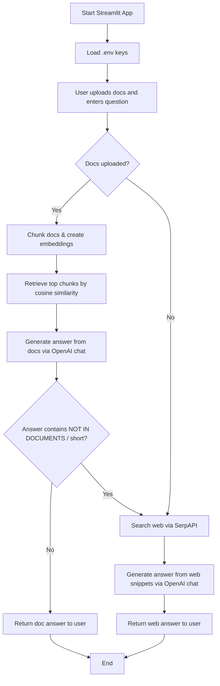

# Minimal Streamlit Agentic RAG Documentation

## Overview
This app is a minimal agentic RAG system built with Streamlit. It takes user-uploaded documents and a question, performs retrieval over document chunks, and answers the question. If the answer is not found in the documents, it falls back to web search using SerpAPI.

### Core features
1. Document-based retrieval + answer generation (primary source)
2. Web search fallback using SerpAPI when docs do not contain answer

### Requirements
- `openai` (new OpenAI Python client)
- `streamlit`
- `requests`
- `.env` containing:
  - `OPENAI_API_KEY`
  - `SERPAPI_KEY`

## File layout
- `streamlit_app.py` — main Streamlit app and agent logic
- `.env` — API keys
- `requirements.txt` — needed packages

## High-level flow
1. Load `.env`, read keys and initialize app.
2. User uploads docs and asks a question.
3. If docs exist:
   1. Chunk docs and generate embeddings.
   2. Retrieve top chunks by cosine similarity.
   3. Query OpenAI chat with context and answer.
   4. If answer signals not found, fallback to web search.
4. If no docs uploaded, directly perform web search.

## Flow details

### 1) Environment and keys
- Keys are loaded from `.env` via simple parser.
- `openai_key` and `serp_key` are read into environment and then used.

### 2) Document processing
- Uploaded files (`.txt`, `.md`) are read and text is extracted.
- Text splitting is done with `chunk_text` (220 words + overlap 40).
- Embeddings are created using OpenAI embeddings.

### 3) Retrieval
- Compute cosine similarity between query embedding and chunk embeddings.
- Return top-K chunks (default 3).

### 4) Answer generation
- Build prompt with retrieved context and question.
- Call OpenAI chat (`gpt-4o-mini`) to generate doc-based answer.
- If answer indicates `NOT IN DOCUMENTS` or too short, fallback to web.

### 5) Web search fallback
- Use SerpAPI HTTP endpoint with query.
- Collect top organic snippets and pass to OpenAI chat prompt.
- Return final web-based answer.

## Mermaid flow chart


## Usage
1. Install dependencies:
   ```bash
   pip install -r requirements.txt
   ```
2. Run:
   ```bash
   streamlit run streamlit_app.py
   ```
3. Open the URL displayed by Streamlit.
4. Upload docs and ask question.

## Notes
- Keep the app minimal: only a single run button and output.
- This app does not store embeddings to disk; it builds each run.
- For production, add caching and input sanitization.
